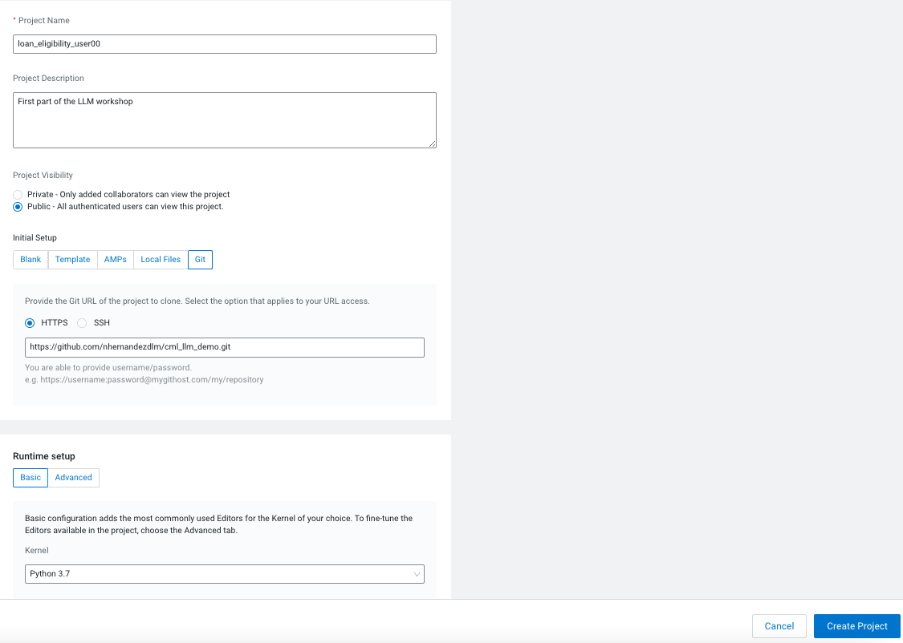
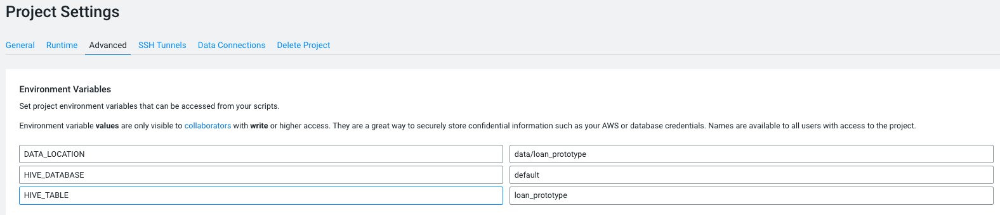
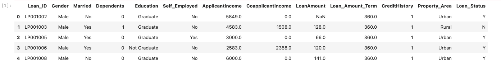
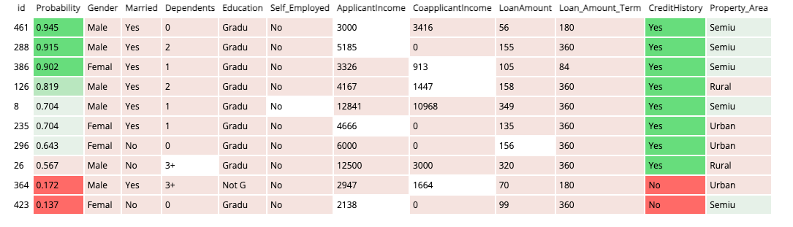
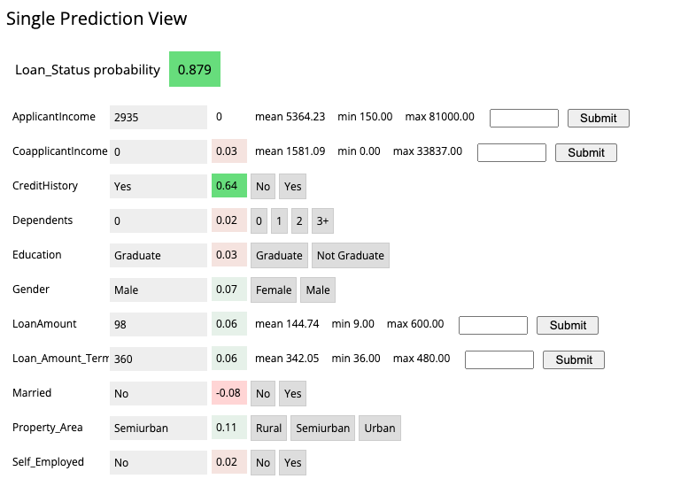
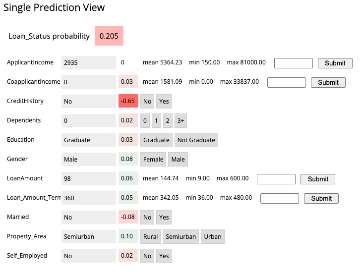

# Project Build Process

The following step-by-step instructions correspond to the project files in this directory and should be followed in sequential order.

### Creating a project

The first step for this lab will be to create a project within CML using this git repo as a starting point. 
For this you will need to:
1. Go to **Projects** --> **New Project**
2. Add the Project Name of your choice (We recommend adding your user_id to avoid duplicate names) 
3. **Select Public Visibility** 
4. **Initial Setup:** Git and paste the URL in the text box : https://github.com/nhernandezdlm/cml_llm_demo.git 
5. **Runtime:** Basic and select the **Python 3.7 Kernel** 
6. Click in **Create Project**



Before starting the project, you will need to set some initial enviroment variables in the Project level. For that, within CML, go to **Project Settings** --> **Advanced** and add the following:



- DATA_LOCATION --> data/loan_prototype
- HIVE_DATABASE --> default
- HIVE_TABLE --> loan_prototype


### 0 Bootstrap

There are a couple of steps needed at the start to configure the Project and Workspace settings so each step will run successfully. If you are building the project from the source code, then you must run the project bootstrap file before running other steps.

Open the file `0_bootstrap.py` in a normal workbench Python3 session. You only need a 1 vCPU / 2 GiB instance. You must enable Spark. Once the session is loaded, click **Run > Run All**. This will file will first install project requirements. Then it will create environment variables for the project called **STORAGE** which is the root of default file storage location for the Hive Metastore in the DataLake (e.g. `s3a://my-default-bucket` if on AWS), and **STORAGE_MODE** which indicates if external storage is available or not. If not, the project will be build using local project storage only. This script will also upload the data used in the project to `$STORAGE/$DATA_LOCATION/`. The original file comes as part of this git repo in the `raw` folder.


### 1 Ingest Data

This script will read in the data csv from the file uploaded to the object store (s3/adls) setup during the bootstrap and create a managed table in Hive. This is all done using Spark.

Open `1_data_ingest.py` in a Workbench session: Python3, 1 CPU, 2 GB. Run the file.


### 2 Explore Data

This Jupyter Notebook does some basic exploratory data analysis (EDA) and visualization. It is to show how EDA fits into the data science workflow.



This time, open a Jupyter Notebook session (rather than a workbench session): Python3, 1 CPU, 2 GB and open the `2_data_exploration.ipynb` file. 


### 3 Model Building

This Jupyter Notebook demonstrates a walkthrough of the process for building the churn prediction model. It also shows more details on how the LIME model is created and a bit more on what LIME is actually doing.

Open a Jupyter Notebook session (rather than a workbench session): Python3, 1 CPU, 2 GB and open the `3_model_building.ipynb` file. 

At the top of the page click **Run > Run All Cells**.


### 4 Model Training

A pre-trained model saved with the repo has been placed in the `models` directory. If you want to retrain the model, open the `4_train_models.py` file in a workbench session: Python3 1 vCPU, 2 GiB and run the file. The newly trained model will be saved in the models directory named `loan_linear.pkl`. 

There are 2 other ways of running the model training process, for the purpose of this lab we will focus on the Jobs:

***1. Jobs***

The **[Jobs](https://docs.cloudera.com/machine-learning/cloud/jobs-pipelines/topics/ml-creating-a-job.html)** feature in CML allows for adhoc, recurring, and dependency triggered jobs to run specific scripts. To run this model training process as a job, create a new job by going to the project window and clicking _Jobs > New Job_ (in the left side bar) and entering the following settings:

* **Name** : Train Model
* **Script** : code/4_train_models.py
* **Arguments** : _Leave blank_
* **Kernel** : Python 3
* **Schedule** : Manual
* **Engine Profile** : 1 vCPU / 2 GiB

Enable Spark and the rest can be left as is. Once the job has been created, click **Run** to start a manual run for that job.


### 5 Serve Model

The **[Models](https://docs.cloudera.com/machine-learning/cloud/models/topics/ml-creating-and-deploying-a-model.html)** feature in CML is used top deploy a machine learning model into production for real-time prediction. To deploy the model that was trained in the previous step, navigate to the project page, then click *Models > New Model* and create a new model with the following details:

* **Name**: Loan Model API Endpoint
* **Description**: Explain loan eligibility for a customer
* **File**: code/5_model_serve_explainer.py
* **Function**: explain
* **Input**: 

```
{
  "Gender": "Female",
  "Married": "Yes",
  "Dependents": "0",
  "Education": "Not Graduate",
  "Self_Employed": "No",
  "ApplicantIncome": 1928,
  "CoapplicantIncome": 1644,
  "LoanAmount": 100,
  "Loan_Amount_Term": 360,
  "CreditHistory": "Yes",
  "Property_Area": "Semiurban"
}
```

* **Kernel**: Python 3
* **Runtime Editor**: Workbench
* **Engine Profile**: 1vCPU / 2 GiB Memory

Leave the rest unchanged. Click **Deploy Model** and the model will go through the build process and deploy a REST endpoint. Once the model is deployed, you can test it is working from the model *Model Overview* page.

**Note:** Once the model is deployed, you must disable the additional model authentication feature. In the model settings page, untick **Enable Authentication**.


### 6 Deploy Application

The next step is to deploy the Flask application. The **[Applications](https://docs.cloudera.com/machine-learning/cloud/applications/topics/ml-applications.html)** For this project it is used to deploy a web based application that interacts with the underlying model created in the previous step.

**Note:** In the deployed model from Step 5, go to **Model > Settings** and make a note (i.e. copy) the 
"Access Key". It will look something like this (ie. mukd9sit7tacnfq2phhn3whc4unq1f38)

From the project level, click on "Open Workbench" (note you don't actually have to Launch a 
session) in order to edit a file. Select the flask/single_view.html file and paste the Access 
Key in at line 61.

`        const accessKey = <your_access_key_here>;`

Save the file (if it has not auto saved already) and go back to the Project. Go to the **Applications** section and select "New Application" with the following details

* **Name**: Loan Analysis App
* **Subdomain**: loan-app _(note: this needs to be unique, so if you've done this before, 
  pick a more random subdomain name)_
* **Script**: 6_application.py
* **Kernel**: Python 3
* **Engine Profile**: 1vCPU / 2 GiB Memory


After the application deploys, click on the blue-arrow next to the name. The initial view is a table of randomly selected records from the dataset. This shows a global view of which features are most important for the predictor model. The green shows increased importance for predicting a loan being accepted and the red for loans that will not be accepted.



Clicking on any single row will show a "local" interpreted model for that particular data point instance. Here you can see how adjusting any one of the features will change the instance's loan eligibility prediction.




Changing the CreditHistory to No the probability of a loan being accepted. This does not mean that changing the Credit History cause the probability to go down, this is just what the model would predict for a customer with those data points.



